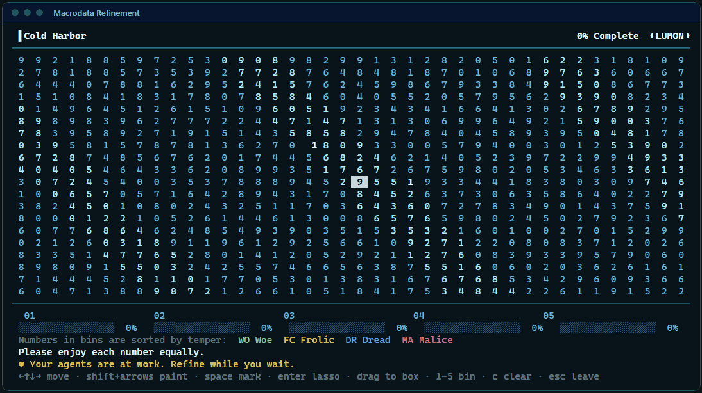

# Claude Code mods

Mods for [Claude Code](https://claude.com/claude-code): panes, games and toys to have open while your agents work.



## Install

Add this repo as a plugin marketplace once, in Claude Code:

```
/plugin marketplace add magnuswiderberg/claude-code-mods
```

Then install the mods you want:

```
/plugin install severance-mdr@magnus-mods
```

To get updates, run `/plugin marketplace update magnus-mods`.

## Mods

| Mod | What it is |
| --- | --- |
| [severance-mdr](plugins/severance-mdr) | Macrodata Refinement from *Severance*. Find the scary numbers and sort them into bins while your agents work. |

## Good to know

These mods use the Claude Code plugin API for function hooks. That API is in early access and may change between Claude Code releases, so a mod can stop working after an update until it's fixed here.

## Develop

Each mod is a plugin folder under `plugins/`. To work on one, start Claude Code with that folder loaded. It reloads the mod when you save a file:

```
claude --plugin-dir plugins/<mod>
```

Check a mod before pushing:

```
claude plugin validate plugins/<mod>
claude plugin test plugins/<mod>
claude plugin validate .claude-plugin/marketplace.json
```

To add a mod, create `plugins/<mod>/` and add an entry for it to `.claude-plugin/marketplace.json`.

To release a change, bump `version` in that mod's `.claude-plugin/plugin.json` and push.

To record the GIF at the top of this README again after changing severance-mdr, run `bun scripts/record-mdr.ts`. It needs Bun, ImageMagick and Edge or Chrome.
